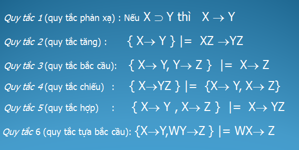
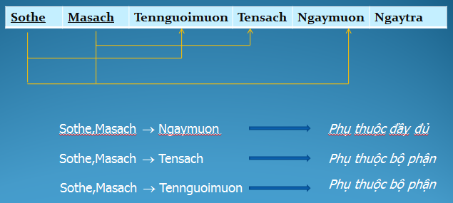
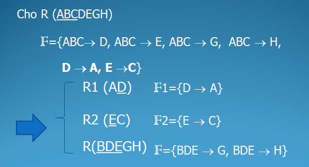

# 1.Quy trình thiết kế
* Khảo sát yêu cầu
* Thiết kế ER
* Lược đồ quan hệ
* Hệ quản trị CSDL quan hệ 
# 2.MÔ hình thực thể liên kết (ER)
## Các loại quan hệ:
* 1-1
* 1-n
* n-1
* n-n
## Ký hiệu trong sơ đồ thực thể liên kết (ERD)


## Ràng buộc (min,max) 
* (0,1) 
* (1,1)
* (0,n)
* (1,n)


## Loại ràng buộc
* Ràng buộc tham gia toàn bộ : kí hiệu -> hoặc ==
* Ràng buộc tham gia bộ phận : kí hiệu --


## Thực thể yếu 
* Là thực thể không có các thuộc tính khóa,
* Thực thể yếu phải tham gia vào mối quan hệ mà trong đó có một tập thực thể chính (kiểu thực thể chủ)
* Thực thể yếu được xác định bằng cách liên kết với các thực thể chủ (liên kết xác định)
* Mô tả kiểu thực thể yếu và liên kết xác định bằng hình chữ nhật và hình thoi nét đôi


## Các bước thiết kế ER
<ol>
<li>Xác định tập thực thể</li>
<li>Xác định mối quan hệ</li>
<li>Xác định thộc tính và gắn thuộc tính cho tập thực thể</li>
<li>Quyết định miền giá trị</li>
<li>Quyết định thuộc tính khóa</li>
<li>Xác định ràng buộc(tỉ số min max)</li>
</ol>


# 3.EER
EER là sự mở rộng của ER bằng cách thêm vào một số các khái niệm trừu tượng (abstraction) và thể hiện các ràng buộc rõ ràng hơn.
## Lớp con
Lớp kế thừa từ lớp khác


## Ràng buộc rời rạc
Các lớp con độc lập với nhau<br>


## Ràng buộc chồng chéo
Các lớp con này có thể ràng buộc với nhau : lớp con này có thể nằm trong một hay nhiều lớp con khác<br>


## Ràng buộc kiêu hợp
Lớp con kế thừa từ nhiều lớp cha


# 4.Mô hình dữ liệu quan hệ
* quan hệ : bảng
* thuộc tính : cột
* miền giá trị : kiểu dữ liệu
* bộ : hàng
## Lược đồ quan hệ 
TenBang(TenThuocTinh...)<br>
NHANVIEN(MANV,TENNV,NGAYSINH,SĐT)
## Các đặc trưng của quan hệ
### Khóa chính(PK)
* Là thuộc tính của quan hệ mà từ thuộc tính đó ta chỉ có thể xác định duy nhất một thực thể của quan hệ
* KHóa chính có thể gồm một hoặc nhiều thuộc tính
* Mỗi quan hệ chỉ có duy nhất một khóa chính
### Khóa ngoại(FK)
* Khóa ngoại của một quan hệ là thuộc tính của quan hệ mà thuộc tính đó là khóa chính của một quan hệ khác.
* Có thể có nhiều khóa ngoại cùng tham chiếu đén một khóa chính
<br>
### Quy tắc chuyển đổi ERD sang lược đồ quan hệ
* Mỗi kiểu thực thể(Trừ thực thể yếu)sẽ chuyển thành một quan hệ có cung tên và tập thuộc tính
* Thực thể yếu chuyển thành một quan hệ cùng tên thêm vào khóa thuộc tính khóa của thực thể liên quan và khóa chính được xác định từ thuộc tính khóa mới thêm và khóa cục bộ
* Liên kết 1-1:Hoặc thêm vào quan hệ thứ nhất  thuộc tính khóa của quan hệ thứ 2 làm khóa ngoài, và thuộc tính liên kết.Hoặc trộn 2 quan hệ trong trường hợp cả 2 đều tham gia toàn bộ
<br>
* Liên kết 1-n :Thêm vào quan hệ (phía) nhiều thuộc tính khóa của quan hệ (phía)một
<br>
* Liên kết n-n: Tạo một quan hệ mới mà tên quan hệ là tên của mối liên kết,thuộc tính là thuộc tính khóa của những thực thể liên quan và thuộc tính liên kết<br>

* Thuộc tính đa trị : trở thành một quan hệ cùng tên với thuộc tính là các thuộc tính đa trạ và thuộc tính khóa của quan hệ trở thành khóa ngoại.KHóa chính bao gồm khóa ngoại và thuộc tính đa trị
* liên kết đa ngôi(n>2) Chuyển thành một quan hệ Có cùng tên với tên mối liên kết đa ngôi.Thuộc tính gồm thuộc tính liên kết, các khóa liên kết.Khóa chính là tổng hợp các khóa của tập các thực thể tham gia liên kết.
<<<<<<< HEAD
#### Ví dụ

# 5.Chuẩn hóa cơ sơ dữ liệu quan hệ
## 5.1.Phụ thuộc hàm
Ví dụ
```
SINHVIEN(__MASV__,HO,TENDEM,TEN,NGAYSINH,NOISINH,LOP)
MASV -> HO,TENDEM,TEN,NGAYSINH,NOISINH,LOP
SINHVIEN_DIEM(__MASV__,__MAMON__,DIEM,NGAYTHI)
MASV,MAMON -> DIEM
MUON (__SOTHE,MASACH__,TENSACH,TENGUOIMUON,NGAYMUON,NGAYTRA)
SOTHE -> TENGUOIMUON
MASACH -> TENSACH
SOTHE,MASACH,NGAYMUON -> NGAYTRA
```
### Quy tắc phụ thuộc hàm

### Các loại phụ thuộc hàm
* Phụ thuộc hàm đầy đủ: Một phụ thuộc hàm X -> Y  gọi là phụ thuộc hàm đầy đủ nếu khi loại bỏ bất kỳ thuộc tính A nào ra khỏi X thì phụ thuộc hàm không còn đúng nữa. 
* Phụ thuộc hàm bộ phận: Một phụ thuộc hàm  X -> Y là phụ thuộc hàm bộ phận nếu có thể bỏ một thuộc tính A ra khỏi X mà phụ thuộc hàm vẫn đúng.

## 5.2.Chuẩn hóa
Chuẩn hóa là quá trình phân tích lược đồ quan hệ dựa trên các phụ thuộc hàm và khóa chính để đạt được:
* Giảm tối đa sự dư thừa
* Giảm tối đa các thao tác cập nhật dị thường
### 5.2.1.Dạng chuẩn 1 (1NF)
* Miền giá trị của mỗi thuộc tính chỉ chứa giá trị nguyên tử (đơn, không phân chia được)
* Giá trị của mỗi thuộc tính trong các bộ là một giá trị đơn (đơn trị)
<br>Ví dụ:
```
SV_DIEM(__Masv__,__Mamon__, Diem)
Thỏa mãn dạng chuẩn 1

SV(__Masv__, Hoten,Gioitinh,Ngaysinh, Noisinh)
Không thỏa mãn do thuộc tính Hoten có chứa 3 giá trị : HO,TENDEM,TEN
```
NV_DA(__Mada__,Tenda,Manv,Sogio)

|Mada|Tenda|Manv|Sogio|
|----|-----|----|-----|
|C1|iptbles|nv1|120|
|||nv2|100|
|C2|firewall|nv3|120|
|||nv4|150|

Không thỏa mãn do thuộc tính Manv,Sogio chứa nhiều giá trị
#### Chuẩn hóa 1NF
* thuộc tính phức hợp ->các thuộc tính đơn<br>
SV(Masv, __Hoten__, Gioitinh,Ngaysinh, Noisinh)
->
SV(Masv, __Ho__, __Dem__, __Ten__, Gioitinh,Ngaysinh, Noisinh)
* thuộc tính đa trị hoặc lặp -> tách quan hệ<br>
NV_DA(__Mada__,Tenda,Manv,Sogio)
->
NV_DA(__Mada__,Tenda)
NV_DA_CT(__Mada__,__Manv__,Sogio)
### 5.2.2.Dang chuẩn 2 (2NF)
Một  lược đồ quan hệ R ở dạng chuẩn 2 (2NF) nếu: 
* R thỏa mãn chuẩn 1
* Mọi thuộc tính không khóa của R phụ thuộc hàm đầy đủ vào khóa chính.Tức là: mỗi thuộc tính không khóa không phụ thuộc bộ phận vào khóa của R
#### Chuẩn hóa 2NF


### 5.2.3.Dạng chuẩn 3 (3NF)
Lược đồ R là dạng chuẩn 3 nếu:
* Thỏa mãn chuẩn 2
* Không có thuộc tính không khoá nào của R là phụ thuộc bắc cầu vào khoá chính. 
#### Chuẩn hóa 3NF 
* Tách quan hệ mới gồm các thuộc tính phụ thuộc  bắc cầu và thuộc tính không khóa mà nó phụ thuộc vào.
* Loại các thuộc tính phụ thuộc bắc cầu vào thuộc tính khóa trong quan hệ ban đầu;
<br>NV_DV(__Manv__, Hoten, Ngaysinh, Madv, Tendv, MaQl)<br>
Manv->Madv<br>
Madv->Tendv ==> Manv -> Tendv : bắc cầu<br>
MaDv->MaQl ==> Manv -> MaQl : bắc cầu<br>

DV(__Madv__, Tendv, MaQl)<br>
NV(__Manv__, Hoten, Ngaysinh, Madv)<br>

### 5.2.4.Dạng chuẩn Boyce-Codd (BCNF) 
Lược đồ quan hệ R được gọi là ở dạng chuẩn Boyce-Codd (BCNF) nếu:
* Thỏa mãn dạng chuẩn 3NF 
* Không có thuộc tính khóa phụ thuộc hàm vào thuộc tính không khóa
#### Chuẩn hóa BCNF
* Tách các thuộc tính không khóa và thuộc tính khóa phụ thuộc  hàm  vào thuộc tính không khóa đó thành quan hệ mới, thuộc tính không khóa đó trở thành khóa trong quan hệ mới
* Loại các thuộc tính khóa ở bước 1 khỏi lược đồ gốc
* Bổ sung thuộc tính không khóa xác định hàm thuộc tính khóa đã loại bỏ (bước 2) vào khóa của quan hệ gốc




