# 1.Quy trình thiết kế
* Khảo sát yêu cầu
* Thiết kế ER
* Lược đồ quan hệ
* Hệ quản trị CSDL quan hệ 
# 2.MÔ hình thực thể liên kết (ER)
## Các loại quan hệ:
* 1-1
* 1-n
* n-1
* n-n
## Ký hiệu trong sơ đồ thực thể liên kết (ERD)

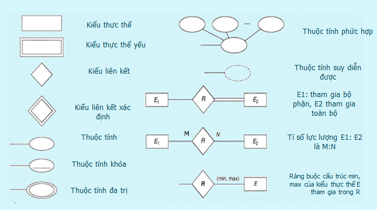
## Ràng buộc (min,max) 
* (0,1) 
* (1,1)
* (0,n)
* (1,n)

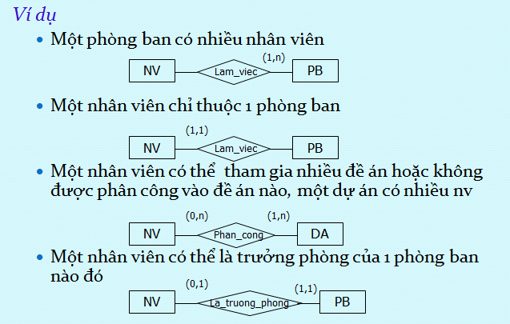
## Loại ràng buộc
* Ràng buộc tham gia toàn bộ : kí hiệu -> hoặc ==
* Ràng buộc tham gia bộ phận : kí hiệu --

## Thực thể yếu 
* Là thực thể không có các thuộc tính khóa,
* Thực thể yếu phải tham gia vào mối quan hệ mà trong đó có một tập thực thể chính (kiểu thực thể chủ)
* Thực thể yếu được xác định bằng cách liên kết với các thực thể chủ (liên kết xác định)
* Mô tả kiểu thực thể yếu và liên kết xác định bằng hình chữ nhật và hình thoi nét đôi

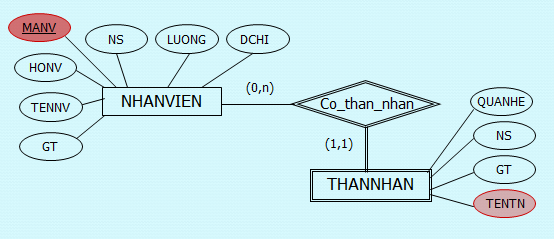
## Các bước thiết kế ER
<ol>
<li>Xác định tập thực thể</li>
<li>Xác định mối quan hệ</li>
<li>Xác định thộc tính và gắn thuộc tính cho tập thực thể</li>
<li>Quyết định miền giá trị</li>
<li>Quyết định thuộc tính khóa</li>
<li>Xác định ràng buộc(tỉ số min max)</li>
</ol>

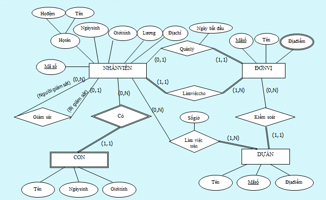
# 3.EER
EER là sự mở rộng của ER bằng cách thêm vào một số các khái niệm trừu tượng (abstraction) và thể hiện các ràng buộc rõ ràng hơn.
## Lớp con
Lớp kế thừa từ lớp khác

## Ràng buộc rời rạc
Các lớp con độc lập với nhau 

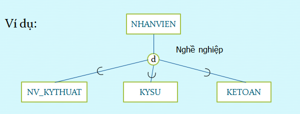
## Ràng buộc chồng chéo
Các lớp con này có thể ràng buộc với nhau : lớp con này có thể nằm trong một hay nhiều lớp con khác 

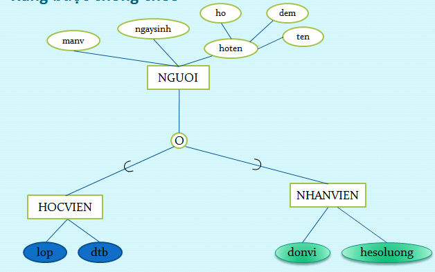
## Ràng buộc kiêu hợp
Lớp con kế thừa từ nhiều lớp cha

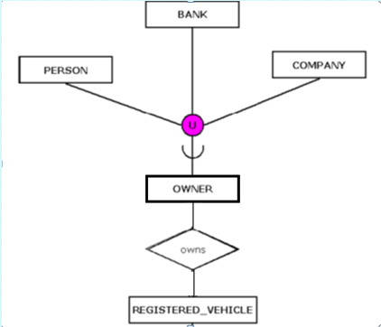
# 4.Mô hình dữ liệu quan hệ
* quan hệ : bảng
* thuộc tính : cột
* miền giá trị : kiểu dữ liệu
* bộ : hàng
## Lược đồ quan hệ 
TenBang(TenThuocTinh...)
NHANVIEN(MANV,TENNV,NGAYSINH,SĐT)
## Các đặc trưng của quan hệ
### Khóa chính(PK)
* Là thuộc tính của quan hệ mà từ thuộc tính đó ta chỉ có thể xác định duy nhất một thực thể của quan hệ
* KHóa chính có thể gồm một hoặc nhiều thuộc tính
* Mỗi quan hệ chỉ có duy nhất một khóa chính
### Khóa ngoại(FK)
* Khóa ngoại của một quan hệ là thuộc tính của quan hệ mà thuộc tính đó là khóa chính của một quan hệ khác.
* Có thể có nhiều khóa ngoại cùng tham chiếu đén một khóa chính
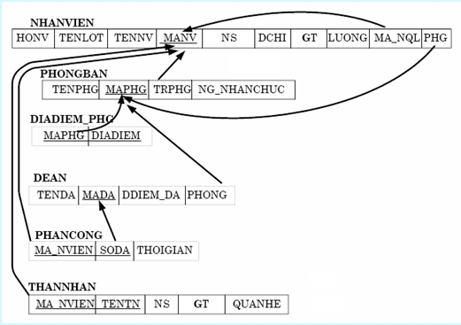
### Quy tắc chuyển đổi ERD sang lược đồ quan hệ
* Mỗi kiểu thực thể(Trừ thực thể yếu)sẽ chuyển thành một quan hệ có cung tên và tập thuộc tính
* Thực thể yếu chuyển thành một quan hệ cùng tên thêm vào khóa thuộc tính khóa của thực thể liên quan và khóa chính được xác định từ thuộc tính khóa mới thêm và khóa cục bộ
* Liên kết 1-1:Hoặc thêm vào quan hệ thứ nhất  thuộc tính khóa của quan hệ thứ 2 làm khóa ngoài, và thuộc tính liên kết.Hoặc trộn 2 quan hệ trong trường hợp cả 2 đều tham gia toàn bộ
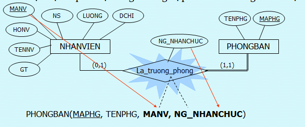
* Liên kết 1-n :Thêm vào quan hệ (phía) nhiều thuộc tính khóa của quan hệ (phía)một
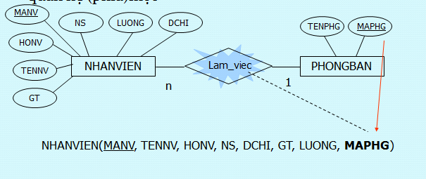
* Liên kết n-n: Tạo một quan hệ mới mà tên quan hệ là tên của mối liên kết,thuộc tính là thuộc tính khóa của những thực thể liên quan và thuộc tính liên kết
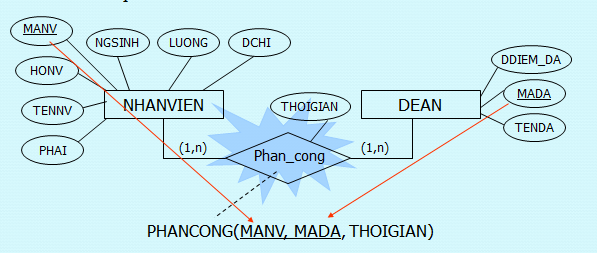
* Thuộc tính đa trị : trở thành một quan hệ cùng tên với thuộc tính là các thuộc tính đa trạ và thuộc tính khóa của quan hệ trở thành khóa ngoại.KHóa chính bao gồm khóa ngoại và thuộc tính đa trị
* liên kết đa ngôi(n>2) Chuyển thành một quan hệ Có cùng tên với tên mối liên kết đa ngôi.Thuộc tính gồm thuộc tính liên kết, các khóa liên kết.Khóa chính là tổng hợp các khóa của tập các thực thể tham gia liên kết.
#### Ví dụ
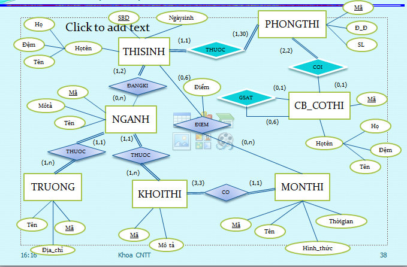

