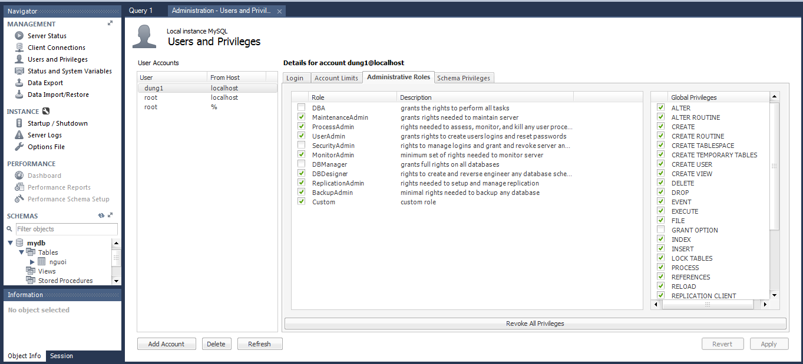

# 1 Quản lý user bằng command
## 1.1 Tạo user
```
#Tạo một user dung1 pass 123
CREATE USER 'dung1'@'localhost' IDENTIFIED BY '123';
```
## 1.2 Xóa user
```
#Xóa user
DROP USER ‘dung1’@‘localhost’;
```
## 1.3 Phân quyền
### Phân quyền root 
```
GRANT ALL PRIVILEGES ON * . * TO 'dung1'@'localhost';
#Thay đổi ngay lập tức
FLUSH PRIVILEGES;
```
### Phân quyền 1 số quyền
cú pháp
```
GRANT [permission type] ON [database name].[table name] TO ‘dung1’@'localhost’;
FLUSH PRIVILEGES;
#Ví dụ
GRANT SELECT,UPDATE ON mydb.nguoi TO 'dung1'@'localhost';
FLUSH PRIVILEGES;
```
Permission type:
* CREATE – Cho phép user tạo databases/tables
* SELECT – Cho phép user truy xuất data
* INSERT – Cho phép user tạo thêm dòng trong bảng
* UPDATE – Cho phép user chỉnh sửa các entry trong bảng
* DELETE – Cho phép user xóa entry trong bảng
* DROP – Cho phép user xóa hoàn toàn bảng/database
## 1.4 Thu hồi quyền
### Thu hồi tất cả quyền
```
REVOKE ALL PRIVILEGES ON *.* FROM 'non-root'@'localhost';
FLUSH PRIVILEGES;
```
### Thu hồi 1 số quyền nhất định
```
REVOKE [permission type] ON [database name].[table name] FROM ‘dung1’@‘localhost’;
FLUSH PRIVILEGES;
#Ví dụ
REVOKE UPDATE ON mydb.nguoi FROM ‘dung1’@‘localhost’;
FLUSH PRIVILEGES;
```
# 2.Quản lý user qua GUI

* Click vào `user and privileges` sẽ hiện ra giao diện để quản lý user
* `add account` để tạo user mới hoặc 'Delete' để xóa
* chọn sang tab `Administrative roles` để thay đổi quyền của user
